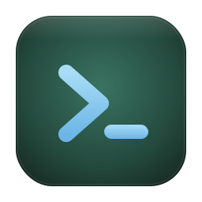

<h1> termset</h1>

**Save your terminal layouts.**

- Save your terminal layout to a YAML file that you can commit into git and open the same on your other devices
- Group and label terminal tabs

Termset is a terminal app, written in Rust. It uses [Alacritty](https://github.com/alacritty/alacritty), a fast cross-platform OpenGL terminal emulator under the hood.

## Usage

```
$ terms terminals.yml     # open a layout file (a default layout opens if missing)
$ terms                 # use ./termset.yml in the current directory
```


`termset.yml`:

```yaml
groups:
  - name: Frontend
    sessions:
      - name: web
        dir: ~/app/web
        command: npm run dev
      - name: storybook
        dir: ~/app/web
        command: npm run storybook
      - name: claude
        dir: ~/app/web
        command: claude
  - name: Backend
    sessions:
      - name: api
        dir: ~/app/api
        command: cargo watch -x run
      - name: worker
        dir: ~/app/api
        command: cargo run --bin worker
  - name: Infra
    sessions:
      - name: postgres
        dir: ~/app
        command: docker compose up db
      - name: redis
        dir: ~/app
        command: redis-server
```

## Shortcuts.

Special key is assumed as macOS (Cmd), Linux (Ctrl+Shift)

 - **New tab**. Ctrl+Shift+T
 - **Close tab**. Ctrl+Shift+W
 - **Navigate up/down tab**. Ctrl+Shift+Up/Down
 - **Collapse/expand section**. Ctrl+Shift+Left/Right
 - **Start / Stop session**. Ctrl+Shift+R / Ctrl+Shift+X
 - **Copy / Paste**. Ctrl+Shift+C / Ctrl+Shift+V (or right-click)
 - **Toggle sidebar**. Ctrl+Shift+B
 - **Edit layout**. Ctrl+Shift+, (opens the YAML in nano)
 - **Quit**. Ctrl+Shift+Q

